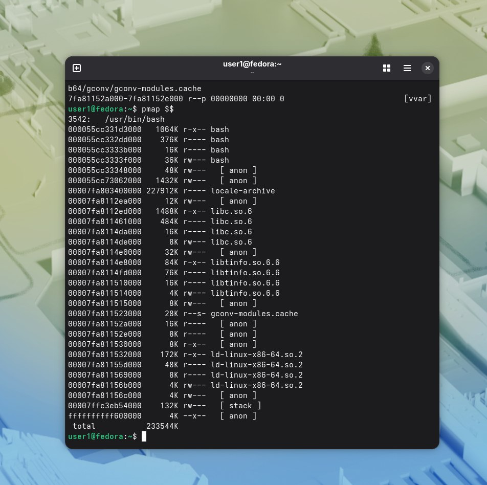

С помощью команды pmap $$ посмотрела области кода,данных,стека,библиотек.
. 
Вопрос 1) /usr/bin/bash это исполняемый файл оболочки bash.  

[heap] этообласть динамической памяти,которую процесс запрашивает у ядра во время выполнения.  

/usr/lib/locale/locale-archive это файл с настройками локализации,например,язык.  

/usr/lib64/libc.so.6 это библиотека языка С,которую используют программы. 

/usr/lib64/libtinfo.so.6.6 это библиотека для работы с терминалом,управляет вводом-выводом в консоли. 

/usr/lib64/gconv/gconv-modules.cache это кэш модулей конвертации кодировок. 

[vvar] это область памяти,предоставляемая ядром,позволяет программам читать некоторые системные переменные.  
Вопрос 2)Код оболочки это сам исполняемый файл /usr/bin/bash.Он в начале.  

Библиотеки в середине списка.Это /usr/lib/locale/locale-archive, /usr/lib64/libc.so.6, /usr/lib64/libtinfo.so.6.6 и /usr/lib64/gconv/gconv-modules.cache.  

Стек в вывод команды cat /proc/
$$/maps | head -20 не попал,но попал в вывод pmap $$.Но он всегда находится на верху адресного пространства.  
Вопрос 3)Pmap показал общий размер.Вывод:  

total           233544K.   

Вопрос 4) Потому что каждый процесс имеет свое виртуальное адресное пространство,мы видим именно виртуальные адреса, они не равны напрямую физическим.
