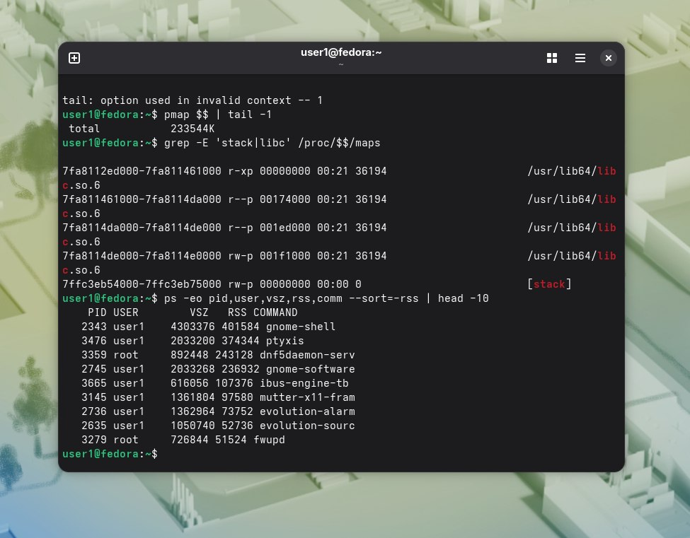

Получила таблицу vsz и rss процессов:  
. 
Вопрос 1). 
Vsz и rss процесса,который зарезервировал память:  

PID    VSZ   RSS COMMAND
   4409  10488  2140 python3. 

Процесса,который записывал 1:  
PID    VSZ   RSS COMMAND
   4426 754200 65756 python3.   
   
Вопрос 2)В первом случае команда просит зарезервировать 500 МБ виртуального адресного пространства.Ядро не выделяет физические чипы ОЗУ,только создает записи о доступности.Наш процесс ничего не пишет в эту память, и поскольку обращений к ней нет, ядру не нужно подкреплять виртуальные адреса физическими страницами.  

Во втором случае мы пытаемся записать 1 по каждому адресу и ядру приходится находить свободную физическую страницу и записывать данные.  
Вопрос 3)Это иллюстрирует принцип из лекции, показывая,что физическая память не тратится, пока нет реальных данных.
   

