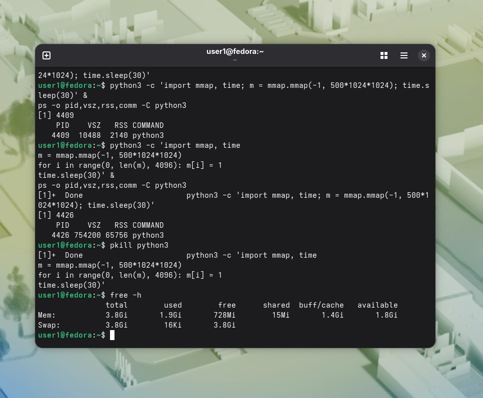
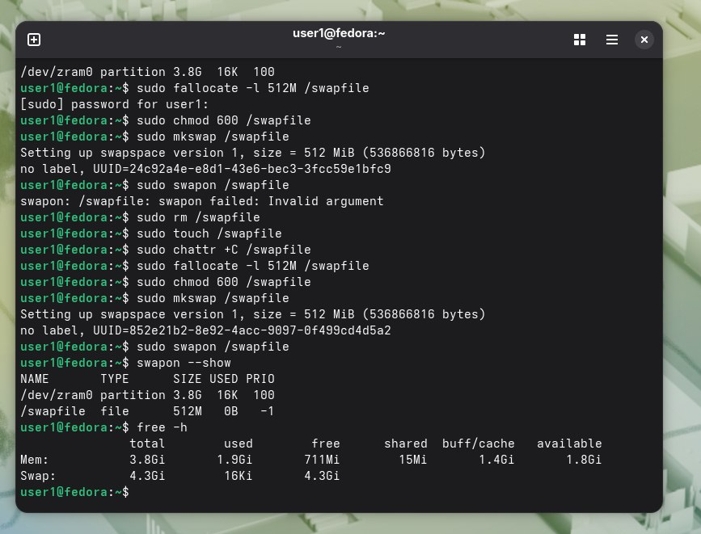

Распределение памяти до подключения swap:  
. 
После:  
. 
Вопрос 1)fallocate создает файл заданного размера и резервирует под него блоки на диске.  

mkswap форматирует раздел, превращая его в область подкачки.  

swapon активирует эту область - подключает ее к виртуальной памяти системы.  
Вопрос 2)swapiness это параметр ядра,определяющий насколько активно система будет перемещать данные из оперативной памяти в пространство подкачки.  

При 60 система довольно охотно выгружает данные в swap, даже если в ОЗУ еще есть свободное место.  

При 10 Система прибегает к swap только тогда, когда оперативная память действительно подходит к концу.  
Вопрос 3)Если операционная система начинает выгружать память БД в swap, время доступа к этим данным возрастает в тысячи раз.Процессор и диски в таком случае могут быть полностью заняты перемещением страниц памяти, а не выполнением запросов.  И нарушается стабильность времени выполнения.

Также лучше быстрый OOM, чем сервер не в состоянии отвечать на запросы часами.
