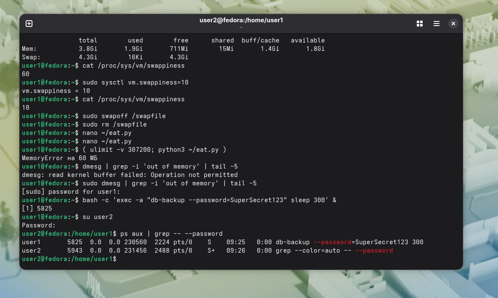
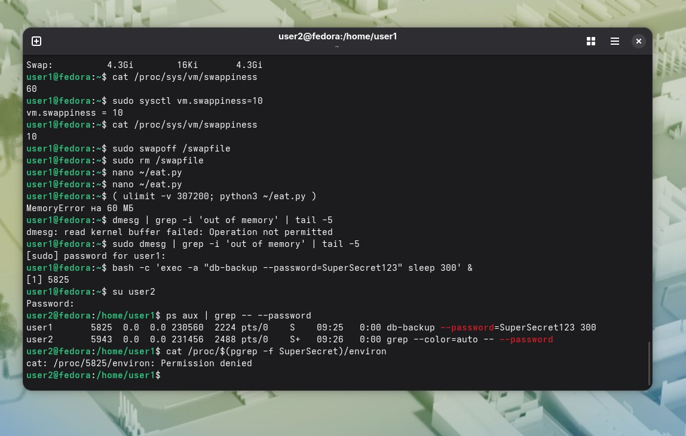

User2 видит чужой пароль,через ps:   
. 
Отклонена попытка прочитать environ:  
. 
Вопрос 1)cmdline доступен всем ,потому что ps, top, pgrep,например, строят свою работу на чтении всех процессов в системе.Без этой возможности невозможно администрирование,так как нужно видеть,что запущено и что оно делает.  

environ недоступен, потому что там нередко хранятся токены доступа или пароли к базам данных.Их всем знать нельзя.  
Вопрос 2)Пароли нельзя передавать в аргументах командной строки, потому что их будет видно всем пользователям системы.Их нужно передавать через интерактивный ввод,файлы с ограниченным доступом или переменные окружения.

